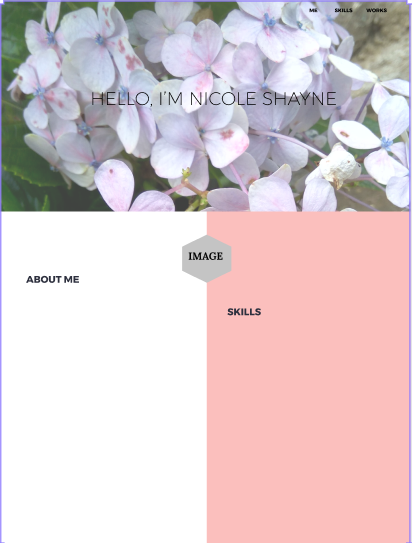
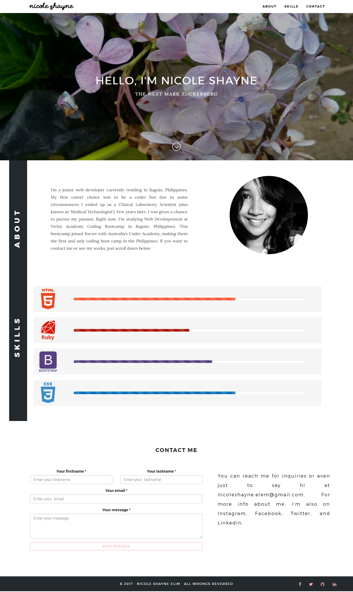

<h1 align="center"></h1>
<h1 align="center">
   </a>
</h1>

<b>Personal portfolio project for Vivixx Academy Coding Bootcamp Term 1. 
Built using HTML, CSS, and Javascript
</b>

---

## The Design Process:

I wanted to create a simple, minimal, and modern look for my website. Trying to be minimalist while looking elegant has always been my goal. My first framework for my portfolio page was this:
 

 
I successfully integrated my initial design into a working HTML page but afterwards, I had to change the whole layout. My website now looks like this:
 

 

