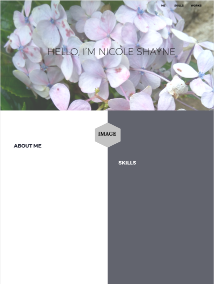

<h1 align="center"></h1>
<h1 align="center">
   </a>
</h1>

<b>Personal portfolio project for Vivixx Academy Coding Bootcamp Term 1. 
Built using HTML, CSS,Bootstrap, and Javascript
</b>

---

## The Design Process:

I wanted to create a simple, minimal, and modern look for my website. Trying to be minimalist while looking elegant has always been my goal. My first workframe for my portfolio page was this:
 
 

 
 
I successfully integrated my initial design into a working HTML page but afterwards, I had to change the whole layout. My website now looks like this:
 
 

 
 
I added a lot of elements to my page - skills progress bar, contact form, and a footer. I also placed a bigger profile image. All photos are mine. My name logo was created using Photoshop (using a free logo font). 
 
 
I will still add other elements to my website, including a portfolio. This website will be updated every now and then. 

## New Design Update:
Changes:
- Added More skills
- Added Portfolio
- Improved Layout
- Better Design

